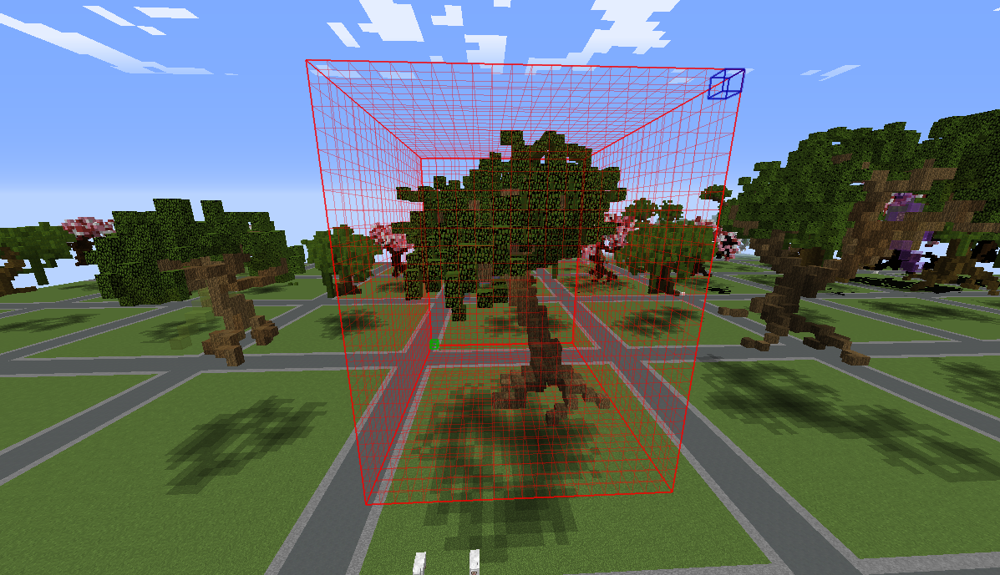
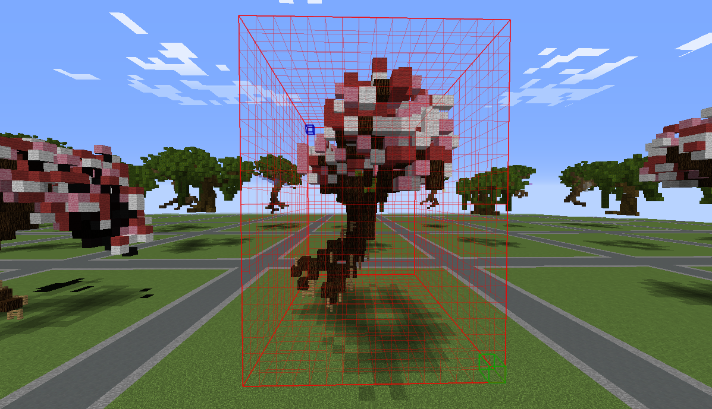
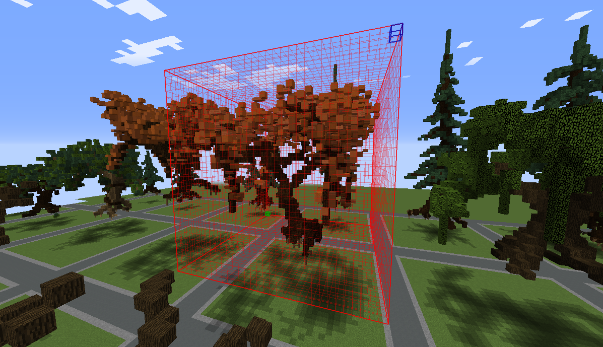

# WorldEdit Structure Selector
Auto selects any structures as a WorldEdit cuboid selection.

This is a useful tool for saving .schematic file with [WorldEdit](https://dev.bukkit.org/projects/worldedit?gameCategorySlug=bukkit-plugins&projectID=31043) or creating BO3 file with [BO3Tools](https://dev.bukkit.org/projects/bo3tools) for [TerrainControl](https://dev.bukkit.org/projects/terrain-control)

### Dependency
This plugin must be used in conjunction with [WorldEdit](https://dev.bukkit.org/projects/worldedit?gameCategorySlug=bukkit-plugins&projectID=31043) or creating BO3 file with [BO3Tools](https://dev.bukkit.org/projects/bo3tools) for [TerrainControl](https://dev.bukkit.org/projects/terrain-control)

### Commands :
* /wss : Display the status of the plugin
* /wss [help] : Display wss help
* /wss [enable|on] : Enable wss
* /wss [disable|off] : Disable wss
* /wss [reload] : Reload wss
* /wss [maxX] : Maximum length on X axis
* /wss [maxY] : Maximum length on Y axis
* /wss [maxZ] : Maximum length on Z axis
* /wss [exclude] : Excluded materials (like DIRT,GRASS or even 1,1:1,WOOL) from selection

### Permissions :
* wss.admin : The only permission to be able to use this plugin. defualt to OP.

### Config :
The plugin use metrics and an integrated updater. Both can be disabled in config.yml

### How to use WSS :
- Enable it : /wss enable
- Get the WorldEdit wand : /wand
- Left click on your structure. By default, the selection size is defined to 32 x 32 x 32 but it can easily be changed in the config.yml or in game.

> Want to have this cool selection in game?
>
> use [WorldEditCUI Forge Edition](https://minecraft.curseforge.com/projects/worldeditcui-forge-edition) or [WorldEditCUI Forge Edition 2](https://minecraft.curseforge.com/projects/worldeditcui-forge-edition-2)
